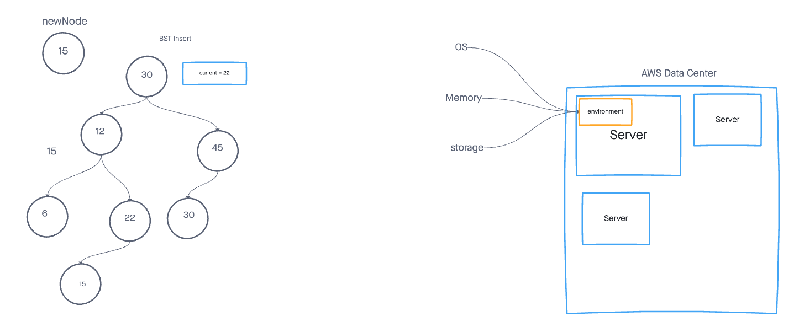

# cloud-server

## Author

Antoine Charette

## Problem Domain

In this lab we are tasked with learning how to use the AWS services. Lab16 requires us to deploy the same simple server in two different ways.

## Links

[GUI Deploy](http://cloudserver-env.eba-ipp9dvs2.us-east-2.elasticbeanstalk.com/)

[Manual Deploy](http://cloud-server-env.eba-vxbeuynz.us-east-2.elasticbeanstalk.com/)

## UML

